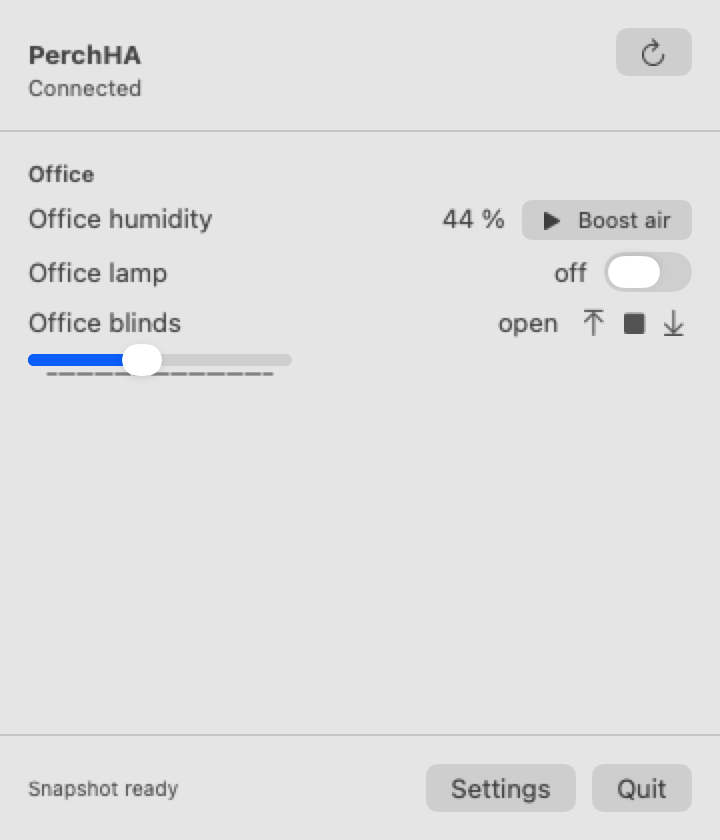
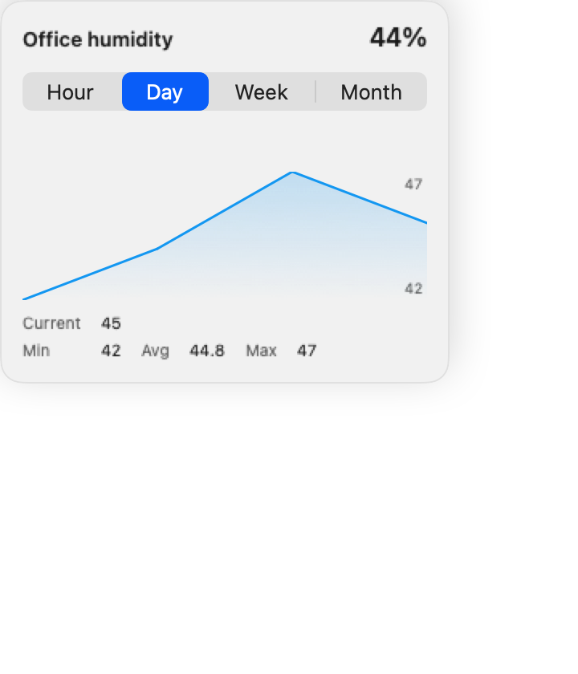
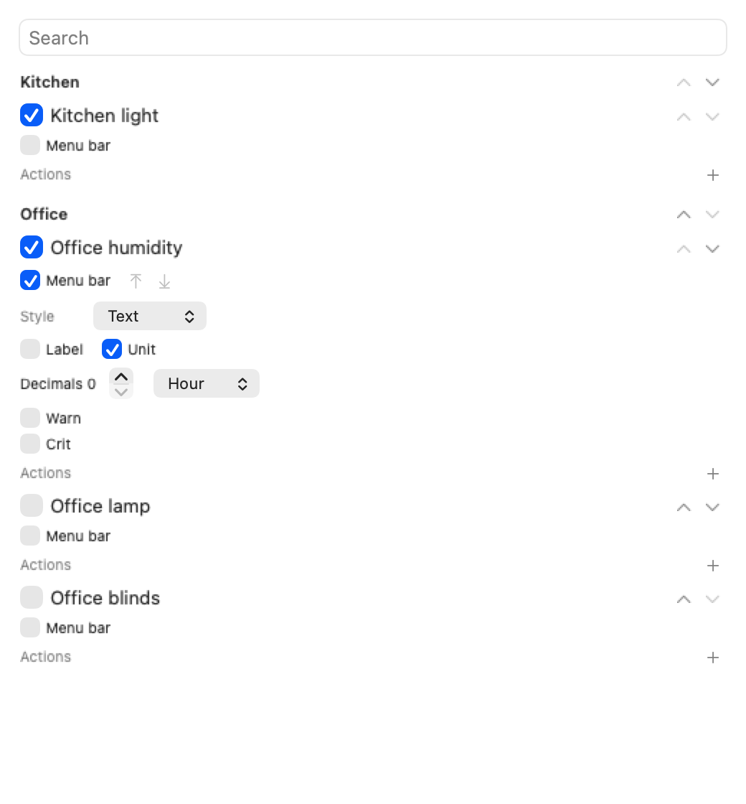

# PearchHA

A native macOS menu bar app for Home Assistant.

[](https://github.com/YunaBraska/pearch_ha/actions/workflows/ci.yml)
[](LICENSE)
[](https://developer.apple.com/macos/)

| Drop-down panel | History detail | Settings |
| --- | --- | --- |
|  |  |  |

## What it does

PearchHA keeps Home Assistant in the macOS menu bar without dragging a browser tab around all day. It can show live values or cheaper timed refreshes, open a room-based panel with history previews and controls, and lets you tune how each entity should look and behave.

## Features

- Menu bar entities with text, icon, gauge, ring, battery, slider, and compact status presentations.
- Native drop-down panel grouped by room, with inline history previews and a full history detail card for hour, day, week, and month when data exists.
- Optional live WebSocket updates while the panel is open, or timed background sync when you want lower CPU use.
- Separate refresh controls for menu bar repaint cadence, background data sync cadence, and history detail refresh cadence.
- Browser sign-in or long-lived token auth, restored from the macOS Keychain after restart.
- Multiple Home Assistant addresses with ordered fallback support.
- Native controls for switches, covers, selectors, sliders, and custom Home Assistant service actions.
- Per-entity display settings for icon, unit, decimals, chart range, menu bar visibility, and menu bar layout.
- Automatic unit scaling for supported numeric families such as power, energy, current, voltage, frequency, pressure, storage, transfer rate, and concentration.
- Threshold colors for numeric sensors and string-state sensors, including default presets you can edit, reset, remove, or replace.
- Linked entities and shared averages for sensors that should be combined into one value family.
- History and panel rendering read from cache first, with background refresh keeping visible data warm.
- FakeHA-backed tests, mirrored Home Assistant fixtures, packaging, and release automation in the same repo.

## Requirements

- macOS 13 or newer.
- A reachable Home Assistant instance.

## Run it

With Xcode:

```sh
open PearchHA.xcodeproj
```

From the command line:

```sh
swift build -c release --product PearchHA
swift run pearchha-package-app \
  --executable .build/release/PearchHA \
  --output .build/PearchHA.app \
  --callback-scheme pearchha \
  --replace \
  --sign-ad-hoc
open .build/PearchHA.app
```

## Verify it

```sh
swift test
sh scripts/check.sh
```

## Docs

- [docs/README.md](docs/README.md)
- [docs/ROADMAP.md](docs/ROADMAP.md)
- [docs/ARCHITECTURE.md](docs/ARCHITECTURE.md)
- [docs/HA_API.md](docs/HA_API.md)
- [docs/TESTING.md](docs/TESTING.md)
- [docs/ADRs.md](docs/ADRs.md)

## Repo layout

```text
pearch_ha/
|- Package.swift
|- PearchHA.xcodeproj
|- Sources/
|- Tests/
|- Fixtures/
`- docs/
```
