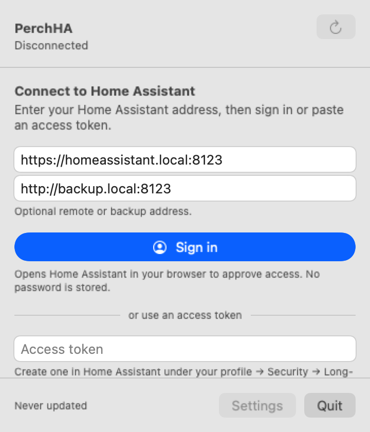

# PearchHA

A native macOS menu bar app for Home Assistant.

[](https://github.com/YunaBraska/pearch_ha/actions/workflows/ci.yml)
[](LICENSE)
[](https://developer.apple.com/macos/)

| Drop-down panel | First run | Settings |
| --- | --- | --- |
|  |  |  |

## What it does

- Menu bar values and gauges.
- Room-based panel with cached history detail.
- Native controls for switches, covers, and custom actions.
- Browser sign-in or token auth, restored from Keychain.
- FakeHA-backed tests and release packaging from the same repo.

## Requirements

- macOS 13 or newer.
- A reachable Home Assistant instance.

## Run it

With Xcode:

```sh
open PearchHA.xcodeproj
```

From the command line:

```sh
swift build -c release --product PearchHA
swift run pearchha-package-app \
  --executable .build/release/PearchHA \
  --output .build/PearchHA.app \
  --callback-scheme pearchha \
  --replace \
  --sign-ad-hoc
open .build/PearchHA.app
```

## Verify it

```sh
swift test
sh scripts/check.sh
```

## Docs

- [docs/README.md](docs/README.md)
- [docs/ROADMAP.md](docs/ROADMAP.md)
- [docs/ARCHITECTURE.md](docs/ARCHITECTURE.md)
- [docs/HA_API.md](docs/HA_API.md)
- [docs/TESTING.md](docs/TESTING.md)
- [docs/ADRs.md](docs/ADRs.md)

## Repo layout

```text
pearch_ha/
|- Package.swift
|- PearchHA.xcodeproj
|- Sources/
|- Tests/
|- Fixtures/
`- docs/
```
